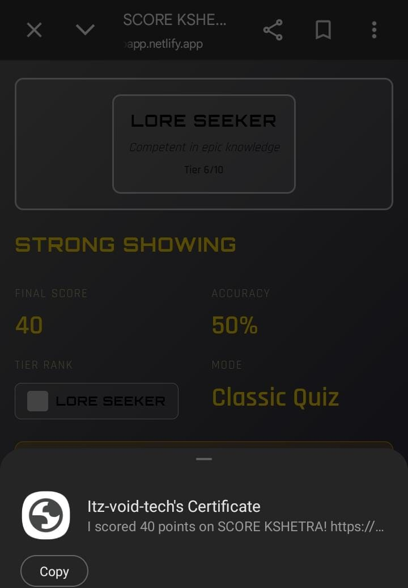

# 🏆 SCORE KSHETRA - Competitive Quiz Platform

**Transform your quiz experience into an epic competitive arena with advanced integrity checking, progression systems, and shareable certificates.**

🚀 **Live Demo:** [https://epicwebapp.netlify.app/](https://epicwebapp.netlify.app/)

---

## ✨ Features

### 1️⃣ **Anti-Cheat Logic (Client-Side Integrity)**
- **Invisible monitoring** of suspicious behavior:
  - Tracks tab switches and visibility changes
  - Detects unrealistically fast answers (< 1 second)
- **Non-blocking approach**: Subtle warnings, no popups
- **Integrity flagging**: Attempts marked as suspicious receive:
  - 20% score penalty
  - Leaderboard annotation (⚠️ badge)
  - Detailed report stored with result

### 2️⃣ **User Tiers System (Progression)**
- **Three competitive ranks**:
  - 💀 **Mortal**: Accuracy < 50%
  - ⚔️ **Hero**: Accuracy 50–80%
  - 👑 **Divine**: Accuracy > 80%
- **Tier displays** on result page, certificate, and leaderboard
- **Dynamic styling**: Glow effects and color themes per tier

### 3️⃣ **Shareable Public Certificates**
- **Unique URL per certificate**: `/index.html?certId=CERT_ID`
- **Public viewing**: No authentication required
- **Verification details**:
  - Player name, score, accuracy
  - Tier badge with special effects
  - Certificate ID for authenticity
- **One-click share link** button

### 4️⃣ **Offline-First Support**
- **Local caching**: Questions and progress saved in `localStorage`.
- **Automatic sync**: When back online, leaderboard entries and certificates upload to Firebase automatically.

### 5️⃣ **Game Modes System**
Three distinct modes affecting scoring, difficulty, and gameplay:

| Mode | Icon | Description | Time/Q | Lives | Multiplier |
|------|------|-------------|--------|-------|------------|
| **Classic** | ⚔️ | Steady. Strategic. | No limit | ∞ | 1x |
| **Survival** | 🔥 | One wrong = end | 30s | 1 | 1.5x |
| **Speed** | ⚡ | Fast answers earn bonus | 15s | 3 | 1.3x |

---

## 🎮 How to Play

### Quick Start
1. **Enter Name**: Personalize your profile before starting.
2. **Select Mode**: Choose Classic, Survival, or Speed.
3. **Answer Questions**: Select from 4 options per question.
4. **View Results**: See your final score, tier, and generated certificate.

### Scoring Rules
Base Score = 10 points per correct answer

Classic Mode: 10 × 1 = 10 points
Survival Mode: 10 × 1.5 = 15 points
Speed Mode: 10 × 1.3 + speed bonus = 13-20 points

**Speed Bonus Formula**:
$$Speed Bonus = 10 \times \frac{TimePerQ - AnswerTime}{TimePerQ} \times 0.5$$

---

## 📊 Results & Sharing

Once the quiz is complete, players receive a comprehensive breakdown of their performance, including accuracy percentages and their earned Tier.

Players can then generate a public link to showcase their achievements to the community.

---

## 🔧 Architecture

### Module Structure
index.html             # Main UI structure
├── integrity.js        # Anti-cheat monitoring
├── tiers.js           # Progression system
├── modes.js           # Game mode logic
├── offline.js         # Offline support
├── storage.js         # localStorage management
├── firebase-config.js # Firebase sync (optional)
└── script.js          # Main app orchestration

style.css              # Responsive, dark-mode design

### Key Classes

**IntegrityMonitor** (`integrity.js`)
- `checkAnswerSpeed()`: Detects speed violations.
- `applyIntegrityPenalty(score)`: Deducts 20% if flagged.

**TierSystem** (`tiers.js`)
- `calculateTier(accuracy)`: Logic for Mortal, Hero, or Divine status.

---

